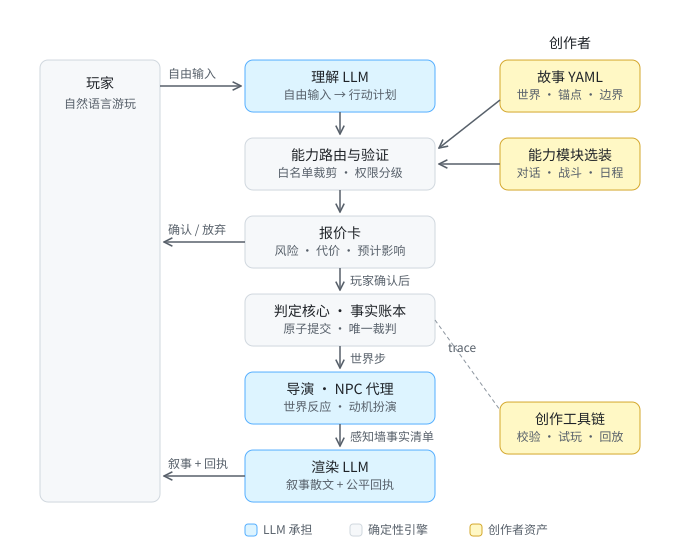

# AIRPG — LLM 原生互动叙事引擎

一个"强导演 AI 互动叙事"引擎：**LLM 是大脑，能力模块是手脚，判定核心是账本，作者剧本是锚点，玩家的自由表达是唯一输入。**

本文档描述项目的**终局形态**，为后续实现指明方向。它是活文档：每次里程碑复盘时都应审视一遍——修正不合理之处、补充当时未察觉的必要模块、替换更好的方案（见文末[修订约定](#修订约定)）。

三条不可动摇的底线（历次试玩复盘沉淀，详见 [engine-principles](docs/engine-principles.md)）：

1. **不做某个故事或某个类型的专用引擎**——引擎代码不认识故事专名，词汇全部属于内容。
2. **LLM 不是文字润色器**——它承担理解、规划、创造、扮演与导演，而非只把模板文本说得好听。
3. **判定不交给 LLM**——世界事实、权限、不变量与原子提交由确定性内核裁决，LLM 永远不当裁判。

## 终局形态总图



中间竖列是运行时管线：理解 → 路由验证 → 报价 → 原子提交 → 世界反应 → 叙事渲染。蓝色环节由 LLM 承担，灰色是确定性引擎，右侧琥珀色是创作者资产。目标循环（2026-07-10 确立）：

```text
玩家自由输入
→ LLM 理解并生成 ActionPlan
→ 能力工具验证位置、物品、资源和权限
→ 将拒绝项返回 LLM，允许有限重规划
→ 显示风险报价并由玩家确认
→ 引擎原子提交真实状态
→ LLM 导演安排世界与 NPC 反应
→ 角色记忆和长期计划更新
→ LLM 渲染叙事（事实清单内，不得扩展事实）
```

## 玩家如何与系统交互

玩家的全部交互就是**说话**。CLI 的意图菜单、编号、对象 ID 都是阶段 2 脚手架，终局（Web 形态）里退化为可选快捷方式。一个回合：

1. **自由表达**："我假装醉酒撞翻酒盘，趁乱溜向侧梯。"不需要任何系统词汇。
2. **复述 + 报价**：系统复述它理解的意图，报价卡列出风险、代价、预计影响与玩家自身的移动——全部经感知墙过滤。低风险动作免报价直接执行。
3. **确认即契约**：确认的就是发生的；系统接不住就明说哪里没接住，反问不扣时间；未预写的尝试付出时间代价换探索（fail-forward）。
4. **结果 = 散文 + 回执**：LLM 叙事负责沉浸，机械回执（状态变化、新记录、判定档位）恒显示——回执是公平性承诺，如同当面落下的骰子。
5. **对话即玩法**：与 NPC 交谈进入对话模块，NPC 按动机接话、按 authority 分级决定什么秘密说得出口。

对玩家的三条承诺：**看到的都是真的**（叙事不虚构事实）、**确认前不吃亏**（无效输入零成本）、**世界记得一切**（账本从不出错）。

## 故事创作者如何与系统交互

创作者是**声明世界的立法者**，不是枚举所有合法互动的程序员。他们提交四类内容资产（今天是 YAML，终局有编辑器包装，schema 见 [content-schema](docs/content-schema.md)）：

1. **世界事实**：空间图、人物及动机、物品位置、初始状态——账本的初始页。
2. **因果锚点**：storylet 不是行为白名单，而是关键因果的承诺（"信任到 3，艾拉会交出钥匙"）、节拍与结局。锚点之间的缝隙由 LLM + 能力模块即兴填充。
3. **边界与披露**：`resolution_limits` 声明数值世界的物理常数，`perception` 声明玩家能看见什么以及怎么称呼（感知墙），世界边界声明什么绝不可能发生。这是给 LLM 戴的镣铐，也是作者主权的表达。
4. **能力模块选装单**：类型 = 一组默认能力、UI 与 Prompt 配置，不是另一套引擎。

配套工具链让创作像带 CI 的开发：**校验器**在写作时拦住已知类别的坑（一类 bug 一条规则）、**walkthrough 模拟器**保证可解性回归、**LLM 玩家代理**自动跑几十局做平衡、**trace 回放**让每一局的每个计划、验证、报价、提交都可审计。

创作者永远不写代码、不写 prompt；引擎不认识他们的词汇，他们也不需要认识引擎的。

## 类型 = 能力模块选装

| 能力模块 | 悬疑（当前） | 都市日常 | 修仙 |
|---|---|---|---|
| 空间 / 位置 | ✅ | ✅ | ✅（需大图分层） |
| 物品 / 背包 | ✅（缺拾取、消耗） | ✅ | 需消耗 + 合成 |
| 事实日志 | ✅ | ✅ | ✅ |
| 关系 / 对话 | 弱（仅数值） | **核心，缺** | 需要 |
| 时间 | 倒计时 | **日程循环，缺** | **跳跃蒙太奇，缺** |
| 战斗 | 不需要 | 不需要 | **核心，缺** |
| 经济 | 不需要 | 轻量，缺 | 中等 |

每个模块不仅提供规则，还向 LLM 暴露工具、观察信息、可提议效果和不变量。协议见 [llm-action-plan-protocol](docs/llm-action-plan-protocol.md)。

## 现状对照（2026-07-13）

**已落地**：理解 → 路由 → 报价 → 账本 → 渲染的完整纵向链路（DeepSeek + mock/replay）；感知墙；报价约束力与 fail-forward 政策；澄清延续；trace；LLM 空提议的内容兜底；独立行动回应通道与世界节拍归因；叙事目标位置与过去事件接地；归因安全的模板回退；裸自然语言 CLI；通用 CLI 故事发现；校验器 / walkthrough / 单元测试（77 项）。

**雏形**：导演与 NPC 仅有 world_rules 移动规则；能力模块还是静态路由器的一体化实现，"选装"未成立；现有《午夜前的档案室》和都市日常《晚风中的一桌饭》两个样板故事。

**未开始**：对话模块、战斗 / 日程 / 经济模块、跨会话成长、Web UI、LLM 玩家代理。

**演进顺序**（依据与详情见 [mvp-implementation-plan](mvp-implementation-plan.md) 与 [dev-notes](dev-notes/)）：

1. 用修复后的链路再做真实试玩，补齐创造性行动 trace；
2. **故事 #2**（关系驱动的都市日常）+ 纸面模块化记账——把模块边界从假设变成证据；
3. 正式能力模块化重构（协议接口不动，动路由器背后的实现）；
4. **对话模块**作为第一个按正式接口实现的能力模块，在两个故事上验证；
5. 导演反应与 NPC 动机规划接入 LLM；
6. Web 形态与 LLM 玩家代理；修仙类型作为战斗 / 成长 / 时间跳跃的极限压力测试。

## 修订约定

- 本文档描述**终点**，[engine-principles](docs/engine-principles.md) 约束**过程**（遇到问题改哪一层）；两者冲突时先在复盘中解决冲突，再改文档。
- 每个里程碑（新故事、新模块、阶段切换）复盘时通读本文档：修正被实践证伪的判断、添加新识别的必要模块、更新现状对照与总图。
- 修改需在下表留痕，重大方向变更应同时在 dev-notes 记录论证过程。

| 日期 | 版本 | 变更 |
|---|---|---|
| 2026-07-12 | v0.1 | 初版：终局总图、玩家 / 创作者交互契约、模块选装表、现状对照与演进顺序 |

## 快速开始

```bash
python3 -m venv .venv && source .venv/bin/activate
pip install -r requirements.txt

# 游玩（LLM 模式需要 DEEPSEEK_API_KEY）
python server/cli.py --llm deepseek   # 未指定故事时从 content 目录选择
python server/cli.py content/rooftop_supper.yaml --llm deepseek
python server/cli.py content/midnight_archive.yaml --llm deepseek
# 校验内容与可解性回归
python tools/validate_content.py content/midnight_archive.yaml
python tools/check_walkthroughs.py content/walkthroughs/midnight_archive.yaml
# 测试
python -m pytest tests/ -q
```
