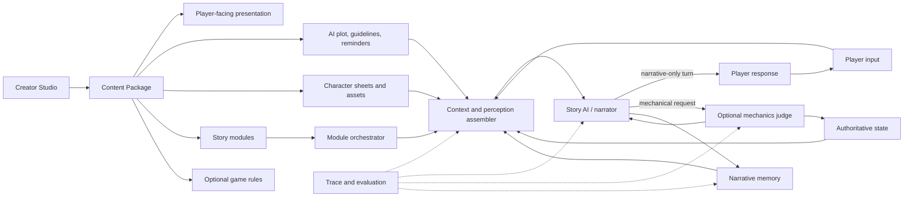

# ISEKAI ZERO Creator's Guides 总结与 AIRPG 能力反推

日期：2026-07-16

状态：基于当前叙事优先运行时的能力分析

外部资料：[ISEKAI ZERO Creator's Guides](https://docs.isekaizero.ai/books/creators-guides)

> 本文逐篇总结 Creator's Guides 当前收录的 8 篇文章，再从创作者工作流反推一个完整 AI 互动叙事系统需要具备的能力，最后对照 AIRPG 当前代码、内容契约和测试分析异同。本文不使用两个 `pre_pivot_archive` 历史故事作为设计样板；AIRPG 现状以当前运行时代码、[`README.md`](../README.md)、[`content-schema.md`](content-schema.md) 和 [`narrative-first-protocol.md`](narrative-first-protocol.md) 为准。

## 0. 结论摘要

Creator's Guides 描述的并不只是一套“怎样写提示词”的技巧，而是一条完整的创作与运行链：

1. 用面向玩家的标题、简介、封面和开场建立期待；
2. 用面向 AI 的剧情蓝图、叙事规则和短提醒约束生成；
3. 用人物动机、压力、行为模式和关系弧维持角色稳定；
4. 用可触发的剧情模块组织开放但有方向的长线故事；
5. 需要机械玩法时，把骰子、数值、物品和规则执行交给独立裁判；
6. 用记忆、状态、分支、富文本和视觉资产把上述能力包装成可长期消费的产品。

AIRPG 当前已经拥有一套可靠的叙事安全底座：自由输入、主体感知隔离、人物位置和关键物品归属、后验事实检查、原子提交、revision、checkpoint、分支、原始记忆、滚动小结和行动提案。它适合承载人物较少、场景有限、以对话和选择为主的中短篇互动故事。

当前最关键的缺口并不是没有完整 RPG 数值系统，而是“作者提供的数据”和“旁白真正读取的数据”之间存在断层：schema 要求 NPC 的 `motivation`、`voice`、`initial_relationship`，也允许 `secret`，但玩家回合旁白目前只获得 NPC 的 `public_profile`。同样，`premise` 和 `player_role.private_goal` 主要用于内容或开场，没有作为持续的 AI 剧情蓝图进入每回合旁白。结果是系统能记住模型刚刚写过什么，却不一定知道作者最初希望人物为什么行动、怎样说话、长期要把故事引向何处。

因此，AIRPG 的近期优先级应是补齐“叙事上下文编译层”，而不是立刻恢复大规模机械 DSL：

- 正式区分玩家文案、AI 剧情蓝图、叙事指南和高优先级提醒；
- 把当前在场人物的作者卡片作为私有作者上下文交给旁白，但不混入玩家感知；
- 为故事模块提供软触发、已使用和已放弃记录，不让模块直接修改权威状态；
- 让 `ideas` 使用故事方向、人物动机和当前压力，而不只使用可见实体与软记忆；
- 通过新的真实试玩故事验证秘密泄漏、人物漂移、模块重复、记忆压缩和提案质量，再决定哪些问题需要硬规则。

## 1. 八篇文章逐篇总结

### 1.1 The Art of AI Storytelling by Louis

原文：[The Art of AI Storytelling by Louis](https://docs.isekaizero.ai/books/creators-guides/page/the-art-of-ai-storytelling-by-louis)

文章的中心判断是：优秀 AI 故事不依赖庞大的 lore dump，而依赖作者明确告诉 AI“要怎样讲故事、要让玩家产生什么感受”。不同作品可以追求忧伤、牺牲感或力量成长等完全不同的情绪回报，关键是作者要有意识地设计这种回报。

文章把故事提示词分成三层：

- `Prompt Plot`：剧情、人物关系和核心处境；
- `Prompt Guideline`：叙述方式、节奏、视角和行为规则；
- `Reminder`：必须长期记住的少量重点。

对系统的启示是：世界设定不能替代叙事目标；内容 schema 和 prompt 组装器需要显式表达“情绪承诺”和“讲述方法”，不能只提供地点与实体清单。

### 1.2 Prompt Templates & Guidelines: Bot Building Guide

原文：[Prompt Templates & Guidelines: Bot Building Guide](https://docs.isekaizero.ai/books/creators-guides/page/prompt-templates-guidelines-bot-building-guide-by-storiesbynikk)

这篇文章提供了一条较完整的创作流水线：

1. 面向人的 Plot：快速钩子、玩家身份、核心概念、风险和立即选择；
2. 面向 AI 的 Plot：玩家角色、主要目标、对抗力量、类型、玩法循环、阵营和世界规则；
3. Prompt Guidelines：视角与语气、核心关系、节奏与篇章、关键玩法、玩家主体性；
4. AI Reminders：3—4 条最重要、最不可违反的短命令；
5. 最后再确定标题和极短简介；
6. 开场直接进入事件，并以开放问题或立即选择结束；
7. 复杂故事可以提供多个不同起点。

文章还给出了人物卡结构：角色职责、外貌、核心人格、关键经历、口吻与习惯、与玩家的关系、专门的 AI 表演说明。其通用原则是“先定义沙盒和人物动机，再让 AI 在规则内发挥”，而不是预写每一条剧情分支。

对系统的启示是：同一份故事至少需要玩家文案、AI 蓝图、角色卡和运行提醒四种不同数据面；它们不能全被压进一个无结构的大文本字段。

### 1.3 Quick HTML and Markdown

原文：[Quick HTML and Markdown by soph_k](https://docs.isekaizero.ai/books/creators-guides/page/quick-html-and-markdown-by-soph-k)

文章区分了两种用途：

- Markdown 主要改善作者维护和 AI 提示词的可读性，但标记也会占用 token；
- HTML 主要服务玩家可见的故事介绍和视觉包装，应该与 AI 实际读取的提示词分离。

文章还讨论了嵌入式 HTML 渲染器、桌面与移动端差异、响应式验证和 token 成本。其核心并不是要求所有故事使用 HTML，而是说明“玩家可见内容”和“AI 可见内容”应有不同的渲染、成本和安全边界。

对系统的启示是：创作平台需要至少两套预览——玩家最终看到的富文本页面，以及 AI 真正读取的纯文本/结构化 prompt；发布前还需要跨端渲染检查和 token 预算预览。

### 1.4 Better Prompts by @SingularityStories

原文：[Better Prompts by @SingularityStories](https://docs.isekaizero.ai/books/creators-guides/page/better-prompts-by-at-singularitystories)

文章把稳定人物和世界的核心抽象为三项：

- `Motivation`：人物想得到什么、害怕什么、为什么行动；
- `Pressure`：什么外部或内部压力迫使人物改变；
- `Behavior`：人物在这些动机和压力下会怎样反应。

文章强调完整因果描述优于孤立标签。例如，仅写“害怕蛇”只能覆盖一个关键词场景；写清恐惧的来源、回避方式和人际后果，模型才可能在新场景中推导一致行为。

它同时区分写实人物和风格化人物：写实人物依靠克制、矛盾、习惯和内外反差；风格化人物可以使用 trope，但必须补充人物自己的内在逻辑和适用边界。对已有角色的再现则需要反向分析其动机、触发点、语言习惯和代表性行为，并通过样例对话反复校正。

对系统的启示是：人物卡不应只保存“性格关键词”，还需要因果化的动机、压力响应、外在表现、说话方式和变化条件；系统也需要角色一致性测试，而不能只验证 JSON 是否合规。

### 1.5 Character Image Generation

原文：[Character Image Generation by storyteller](https://docs.isekaizero.ai/books/creators-guides/page/character-image-generation-by-storyteller)

文章描述了从一张基础角色图生成中立、高兴、大笑、生气、悲伤、哭泣、害羞、怀疑、厌恶和害怕等表情/姿势变体的工作流，并在最后进行裁切、放大、去背景和人工修补。

对系统的启示是：角色视觉不是单张头像，而是一组具有同一身份、不同情绪标签和透明背景的可复用资产。平台需要角色资产 ID、表情枚举、版本管理、透明度检查、裁切规范和运行时表情选择能力。

### 1.6 Cover Page Creation

原文：[Cover Page Creation by storyteller](https://docs.isekaizero.ai/books/creators-guides/page/cover-page-creation-by-storyteller)

文章将封面生成拆成构图、标题文字和后期编辑：可以由不同模型分别完成更擅长的部分，然后合成最终结果。它还强调反复生成、去除模型水印或瑕疵、人工选择与修补。

对系统的启示是：故事发布需要独立于运行时的封面资产管线，包括尺寸规范、角色参考图、标题安全区、生成历史、人工选稿、编辑和最终发布版本；封面不应消耗故事运行 prompt 的 token。

### 1.7 How to Use Modules to Structure a Story

原文：[How to Use Modules to Structure a Story by lostfox](https://docs.isekaizero.ai/books/creators-guides/page/how-to-use-modules-to-structure-a-story-by-lostfox)

文章用“模块”组织开放故事。模块不是固定下一步，而是 AI 可以根据玩家行动和当前情境选择的剧情材料。不同故事可以有不同分类：

- 线性故事：核心剧情、世界支线、关系模块、成长或变形模块；
- 沙盒故事：约会模板、外部压力、人物危机、选择余波；
- 每个模块至少说明“发生什么”和“何时适合触发”；
- 玩家忽略钩子时应该允许它自然消退，玩家追随时才继续升级；
- 模块不是封闭全集，AI 仍可创造符合规则的新场景。

文章也展示了阶段、阈值、关系深入、时间经过、玩家选择和已经体验过的模块数量等触发条件。

对系统的启示是：开放叙事仍需要结构，但结构应是“候选剧情压力和可复用场景”，而不是行动白名单。运行时需要知道哪些模块当前可用、已出现、已忽略、已解决或正在升级，同时不替玩家强制选择。

### 1.8 Dungeon Mind

原文：[Dungeon Mind (DM)](https://docs.isekaizero.ai/books/creators-guides/page/dungeon-mind-dm)

Dungeon Mind 是独立于故事 AI 的机械裁判。故事 AI 负责识别何时需要裁决并根据结果写叙事；DM 负责：

- 服务端 d20、优势和劣势；
- 角色属性创建与更新；
- 物品和技能增删；
- 战斗、检定、资源消耗、休息、升级、状态和死亡；
- 在信息不足时向玩家追问；
- 拒绝违反游戏规则或直接篡改数值的行动；
- 用结构化结果提交所有数值变化；
- 在 UI 中分别显示叙事、骰点、属性变化和角色表。

创作者负责配置 Game Rules、短 Reminder、告诉故事 AI 何时调用 DM 的 Instruction，以及 5—15 个左右的属性 schema。DM 每次读取规则、最近消息、当前角色表和短提醒，但不依赖完整聊天历史。

对系统的启示是：当故事包含可重复计算的机械规则时，叙事模型不应兼任最终裁判。机械结果必须由有工具权限的独立组件产生，并通过结构化状态和 UI 回执呈现。不过这种裁判适合做选装模块，不应强迫纯人物故事也使用骰子和属性。

## 2. 从指南归纳出的共同创作原则

八篇文章可以归纳为七条跨题材原则。

### 2.1 情绪承诺先于设定规模

故事首先需要回答“希望玩家持续获得什么感受”，其次才是世界百科。情绪承诺会影响人物冲突、节奏、用词、奖励反馈和结局气质。

### 2.2 玩家文案与 AI 指令必须分层

玩家文案可以保留悬念、风格和视觉效果；AI 指令必须清楚、直接、包含必要剧透。二者的渲染规则、token 成本和安全策略都不同。

### 2.3 人物靠因果模式保持一致

稳定人物不是关键词集合，而是“动机遇到压力后产生行为”的可推导模型。口吻、习惯、关系和秘密都应该服务这个因果模型。

### 2.4 玩家主体性是运行时规则

AI 可以描述行动后果，不能替玩家决定思想、对白或下一步。开场、模块和行动建议都应提供钩子，而不是替玩家完成选择。

### 2.5 开放故事仍需要方向

完全自由生成容易漂移和重复，完全预写又会产生组合爆炸。模块化方案位于两者之间：作者提供剧情材料、触发语义和压力方向，AI 根据玩家行为选择、改写或放弃。

### 2.6 叙事与机械裁决需要不同权限

叙事可以即兴补充不会改变连续性的细节；位置、物品、属性、骰点和资源等可验证事实需要结构化权限边界。机械越复杂，越需要独立裁判和专门 UI。

### 2.7 创作者体验是产品能力的一部分

提示词分栏、token 预览、角色资产、封面、移动端预览、测试对话和发布流程都会直接影响最终内容质量。只有 YAML 或一个大文本框，无法长期支撑大量非工程创作者。

## 3. 反推系统所需的能力与模块

下面的结构不是在主张所有能力都必须进入 AIRPG 默认核心，而是在说明：如果要完整承载指南中的创作方式，产品总体上需要哪些职责，以及它们之间应该如何分权。



### 3.1 创作数据模型

#### A. 玩家展示层

至少包含：

- 标题、短简介、长介绍、题材标签和内容提示；
- 封面、角色预览和可选富文本；
- 一个或多个开场场景；
- 玩家角色的公开身份与可选 Persona；
- 玩家指南和玩法说明。

这些内容默认不进入 AI prompt，除非 prompt 编译器显式选取。

#### B. AI 剧情蓝图

至少包含：

- 玩家在故事中的角色；
- 主要目标和核心矛盾；
- 对抗力量、阵营和世界规律；
- 核心玩法循环；
- 情绪承诺与独特体验；
- 作者知道、玩家开场不应知道的真相。

#### C. 叙事指南与提醒

建议分为：

- `guidelines`：视角、语气、节奏、关系处理、暴力或浪漫尺度、玩家主体性；
- `reminders`：极少量、高优先级、每回合都应看到的防漂移规则；
- `boundaries`：世界或安全边界；
- `examples`：少量期望和反例，避免抽象形容词被模型误解。

#### D. 人物卡

建议包含：

- 身份、故事职责和公开形象；
- 动机、恐惧、目标和当前压力；
- 行为模式、矛盾点和变化条件；
- 口吻、习惯和示例对白；
- 与玩家及其他关键人物的初始关系；
- 秘密、披露方式和不能提前泄漏的内容；
- 可选起始属性、物品、技能；
- 头像和表情资产映射。

人物卡必须是作者私有上下文的一部分，而不是原样暴露给玩家的感知快照。

#### E. 故事模块

每个模块建议拥有：

- 分类、标题和叙事目的；
- 可以出现的钩子；
- 自然语言触发语义或可选结构化前提；
- 涉及人物、地点和必要背景；
- 压力升级方向；
- 完成、放弃和余波说明；
- 是否允许重复、冷却时间和优先级；
- 模块不应直接拥有任意状态 patch 权限。

模块状态可以先是软状态：`unseen`、`offered`、`engaged`、`resolved`、`dropped`。只有反复出现且错误代价高的机械条件，才升级为硬校验。

#### F. 可选机械规则

机械模块需要：

- 属性 schema 和角色初值；
- 服务端随机数或其他不可由模型伪造的结果源；
- 战斗、检定、资源、成长和死亡规则；
- 物品、技能和状态效果工具；
- `ask_player`、`reject_action` 和最终结构化提交；
- 与叙事模型隔离的工具权限；
- 玩家可见的机械回执。

纯叙事故事应能完全关闭该模块。

### 3.2 运行时模块

#### A. Context / Perception Assembler

负责按当前主体、位置、已知信息、故事方向和 token 预算组装上下文。它至少要区分：

- 玩家可见感知；
- 旁白可见的作者私有上下文；
- NPC 自己知道的事实；
- 机械裁判需要的最小账本；
- 软记忆和硬状态。

“不给旁白人物秘密”可以避免泄漏，却也会使旁白无法正确扮演人物；“把所有秘密混入玩家快照”又会破坏感知隔离。正确做法是建立独立的私有作者上下文，并对输出泄漏进行测试。对高风险秘密，可以在长篇试玩证明 prompt 防线不足后，再增加选装的披露守卫。

#### B. Story AI / Narrator

负责：

- 承接玩家自然语言行动；
- 扮演当前在场人物；
- 根据动机、压力和行为模式生成回应；
- 维持视角、语气和情绪承诺；
- 不替玩家决定下一步；
- 根据模块提供钩子，但不强制玩家接受；
- 根据机械结果写出散文，不自行改写骰点或状态。

#### C. Character Runtime

即使不采用“每个 NPC 一个独立 agent”，也需要统一完成：

- 选取在场人物卡；
- 组合人物私有知识和亲历记忆；
- 维护口吻和关系连续性；
- 防止远处人物无故介入；
- 区分人物真实动机与玩家已经知道的内容。

#### D. Module Orchestrator

负责根据玩家行为、当前压力、人物关系、时间和已用模块，向旁白提供少量候选，而不是直接生成结局。它需要允许：

- 玩家忽略钩子；
- 模块延后、失效或以不同方式回归；
- 主线、人物、关系和余波模块交织；
- AI 在规则内生成未预写的连接情节。

#### E. Narrative Memory

至少需要：

- 完整原始事件；
- 近期原文窗口；
- 滚动小结；
- 开放事项、人物笔记、场景笔记和已解决事项；
- 按分支恢复；
- token 预算和可观察的裁剪；
- 摘要错误时可回退到原始事件。

进一步扩展可以包括 NPC 独立记忆、章节/篇章摘要、按实体检索和跨进程持久化。

#### F. Authoritative State & Mechanics Judge

硬状态适合保存会造成明确连续性错误的内容，例如人物位置、关键物品、生命、资源和机械状态。它需要 revision、结构化变更、原子提交和可审计回执。普通情绪、关系和承诺不应因为“可能有用”就全部进入硬状态。

#### G. Suggestions / Player Guidance

行动建议需要同时知道：

- 当前可见局面；
- 玩家已经经历和解决的内容；
- 当前故事压力和可用模块；
- 在场人物的公开立场；
- 不同卡片应分别承担顺势、调查、冲突、谨慎或意外等功能。

建议仍然只是可编辑自然语言，不应变成冻结的执行计划。

### 3.3 产品与创作者工具

完整产品还需要：

- 分栏式 Creator Studio 和 schema 校验；
- 最终 prompt 预览、token 估算和字段权重说明；
- 多起点与多 Persona 预览；
- 角色图片、表情、封面和背景管理；
- 桌面与移动端富文本预览；
- 测试对话、回放、分支比较和质量评分；
- 模型选择、成本与延迟观察；
- 发布、版本、迁移和回滚；
- 创作助手，但助手生成的内容仍要经过作者确认。

## 4. 当前 AIRPG 的逐项能力对照

状态说明：

- **已有**：当前代码和测试已经提供可用闭环；
- **部分**：存在相关结构，但数据未完全进入运行时或缺少关键环节；
- **缺失**：当前活动运行时没有该能力；
- **更强但更窄**：一致性保证强于纯 prompt 方案，但覆盖领域较少。

| 能力 | 指南所需 | AIRPG 当前状态 | 判断 |
|---|---|---|---|
| 玩家标题与开场钩子 | 标题、短简介、角色、风险、立即选择 | 有 `title`、`premise`、场景 `entry_text`；开场由 CLI 纯文本渲染，没有独立短简介和多起点 | 部分 |
| 情绪承诺 | 明确希望玩家获得的感受及其叙事手法 | 可写入 `style_bible`，但没有专门字段、校验或评估指标 | 部分 |
| AI Plot | 玩家角色、目标、对抗力量、世界机制、完整真相 | `premise`、`player_role` 和场景目标提供了一部分数据；每回合旁白没有统一的 AI 剧情蓝图 | 部分偏弱 |
| Prompt Guidelines | 视角、语气、节奏、关系、玩法和主体性 | `style_bible` 整体进入旁白，系统 prompt 也规定第二人称和不替玩家决定；缺少正式结构与优先级 | 部分 |
| Reminder | 每回合末尾的少量高权重防漂移规则 | 没有独立 reminder 层；`global_rules` 当前主要读取 `boundaries` | 缺失 |
| 人物卡 schema | 动机、口吻、历史、关系、表演说明 | NPC 被要求填写 `motivation`、`voice`、`initial_relationship`，可选 `secret` | 已有 schema |
| 人物卡运行时消费 | 旁白按人物私有动机和口吻表演 | 玩家感知中的 NPC 描述只来自 `public_profile`；私有字段只进入 NPC 感知接口，而当前没有自动 NPC 回合 | 关键缺口 |
| 动机—压力—行为 | 因果化人物模型和变化条件 | 没有 `pressure`、`behavior`、变化条件或样例对白的标准字段；可临时塞入自由文本，但没有稳定消费约定 | 缺失 |
| 感知与秘密隔离 | 玩家不应提前知道作者私密信息 | 玩家快照不会包含远处人物或 NPC 私卡；边界由代码构建，不依赖把完整世界交给模型 | 已有且更强 |
| 玩家主体性 | AI 不替玩家决定思想、对白和选择 | 旁白与建议 prompt 都有明确限制；建议只返回可编辑自然语言 | 已有 |
| 自由自然语言 | 玩家不受动作菜单限制 | 自由输入与行动提案走同一叙事—抽取—提交管线 | 已有 |
| 故事模块 | 分类、触发、已用、忽略、升级和余波 | `storylets`、任务 flags、条件出口和条件结局已从活动 schema 移除；软记忆能保存开放事项，但不管理模块生命周期 | 缺失 |
| 节奏与篇章 | 早期、中期、后期和关系深入 | 可以写进 `style_bible` 或场景目标；没有运行时篇章/阶段选择 | 部分偏弱 |
| 叙事记忆 | 长线回顾、开放事项和角色连续性 | M1 原始事件、M2 滚动小结、M3 统一裁剪上下文已经实现，并随 checkpoint 和 branch 恢复 | 已有 |
| NPC 独立记忆 | 每个角色只记得自己经历的内容 | 接口保留但当前返回空，玩家记忆不会错误复用给 NPC | 缺失但隔离正确 |
| 人物位置 | 防止远处人物无故出现 | 权威 `positions`、主体感知和后验校验均已实现 | 已有且更强 |
| 关键物品归属 | 防止物品复制、远距转交和归属漂移 | 权威 `item_locations`，检查可见性、可携带性、当前归属和共处位置 | 已有且更强 |
| 普通物品/数量/消耗 | DM 式完整 inventory | 当前只跟踪作者声明的关键物品及其单一位置，没有数量、耐久、消耗或装备语义 | 部分偏弱 |
| 属性与技能 | 自定义数值、枚举、状态和角色表 | 当前权威状态只允许 `positions` 与 `item_locations` | 缺失 |
| 服务端骰子 | 不可由 LLM 操纵的随机结果 | session 保存 RNG 状态用于时间线语义，但当前玩法没有掷骰工具或检定协议 | 缺失 |
| 独立机械裁判 | Story AI 请求、DM 裁决、Story AI 叙事 | AIRPG 同样分离散文、事实抽取和代码检查；但只处理移动和关键物品转手，不是完整游戏裁判 | 更强但更窄 |
| 追问与拒绝 | 信息不足时暂停并问玩家，违规时结构化拒绝 | 物理冲突会拒绝候选并最多重写一次；没有通用 `ask_player` 或 DM 式规则拒绝工具 | 部分 |
| 原子提交与 revision | 所有机械变化一致提交 | `FactBatch`、revision、工作副本和整批拒绝已实现 | 已有且更强 |
| 撤回与分支 | 从历史节点产生独立路线 | checkpoint、undo 和 retained branch 已实现，状态和记忆一起恢复 | 已有 |
| 行动建议 | 多样、可编辑、承接当前故事 | `ideas` 最多五张，使用当前感知和 M3 记忆；没有读取 AI Plot、模块候选和 NPC 私有动机 | 部分 |
| Markdown/HTML | 玩家展示与 AI prompt 分离 | CLI 只做纯文本渲染，没有富文本安全策略和跨端预览 | 缺失 |
| 角色表情资产 | 同一人物的多情绪透明图 | 没有媒体 schema、资产存储和运行时表情选择 | 缺失 |
| 封面资产 | 构图、标题、编辑和发布版本 | 没有封面工作流 | 缺失 |
| 创作者 UI | 分栏编辑、预览、token 与发布 | 当前是 YAML、校验器和 CLI | 缺失 |
| 追踪与质量评估 | 能复现问题并迭代提示词 | trace 会记录生成、抽取、冲突、重写、提交和记忆上下文；离线测试覆盖协议与状态安全 | 已有 |

### 4.1 当前最大的实现断层：人物卡没有进入玩家回合旁白

内容契约要求作者为 NPC 编写：

```yaml
motivation: "人物为什么要行动"
voice: "人物怎样说话"
initial_relationship: "人物怎样看待玩家"
secret: "人物知道但玩家未必知道的内容"
```

但当前链路是：

```text
characters.*.public_profile
→ PerceivedEntity.description
→ build_narrative_facts().在场可见实体
→ NarrativeRequest
```

`motivation`、`voice`、`initial_relationship` 和 `secret` 只会进入 `audience=NPC` 的 `subject_context`。当前玩家回合旁白使用的是玩家 perception，系统也没有自动 NPC 回合。因此这些作者字段虽然通过校验，却没有参与主要游戏生成。

这会造成四类直接风险：

1. NPC 口吻趋于通用，人物之间差异主要靠 `public_profile` 的偶然提示；
2. NPC 行为容易只对最近对话作反应，而不是由长期动机驱动；
3. 作者写下的秘密既不会被正确保守，也不会在合适时机推动人物行为；
4. 记忆小结只能整理模型已经写出的表现，无法补回一开始就没有进入 prompt 的作者意图。

建议新增一个与 `PerceptionSnapshot` 分开的 `NarrativeAuthorContext`：

```text
story_brief
emotional_contract
active_guidelines
critical_reminders
in_scene_character_cards
candidate_modules
```

其中 `in_scene_character_cards` 可以包含动机、口吻、关系和秘密，但必须标注为“用于扮演，不代表玩家已知”。不要把它塞进玩家感知，也不要交给行动建议原样输出。

### 4.2 AIRPG 比指南更强的部分

Creator's Guides 多数依赖 prompt 告诉模型应该怎样做；AIRPG 在以下方面已经提供了代码级保证：

- 玩家和 NPC 感知按主体构建，不把完整世界交给模型再要求忽略；
- 模型不能直接修改权威状态；
- 人物移动和关键物品转手经过实体、可见性、归属和共处检查；
- 整批事实原子提交，失败候选不增加回合或 checkpoint；
- revision 防止旧抽取跨状态提交；
- 软记忆与物理状态分开，并跟随撤回和分支；
- 事实抽取不读取软小结，避免摘要错误污染物理账本；
- trace 能重放生成、抽取、冲突、重写和提交过程。

这些能力是 AIRPG 相对于普通 prompt-first AI RP 的主要价值，不应为了复制对方的创作界面而放弃。

### 4.3 AIRPG 与指南在产品目标上的差异

| 维度 | Creator's Guides 所在平台思路 | AIRPG 当前思路 |
|---|---|---|
| 核心产品 | 创作者发布与玩家消费的 AI RP 平台 | 叙事优先互动小说的可信运行内核 |
| 创作中心 | Prompt、人物 bot、模块、富文本和媒体资产 | YAML 内容、少量作者实体和物理初值 |
| 一致性来源 | 主要依赖提示词、近期上下文、Reminder；DM 可选 | 感知隔离、后验抽取、代码检查和原子状态 |
| 剧情结构 | AI 在 prompt 中选择模块 | 当前不维护模块、任务旗标或条件结局 |
| 机械玩法 | 可挂载 Dungeon Mind | 默认没有数值裁判，只守位置与关键物品 |
| 人物复用 | 人物作为独立 bot，可挂入多个故事 | 人物卡内嵌在单个故事 YAML |
| 玩家表现 | 富文本、图片、角色表、骰点等产品 UI | 纯文本 CLI |
| 长期记忆 | DM 读取近期消息；平台其他摘要能力不属于本指南重点 | M1/M2/M3 是当前核心实现之一 |
| 设计取舍 | 先降低创作门槛和扩大内容供给 | 先缩小权威面并验证真实失真模式 |

两者并非简单的“谁更先进”。Creator's Guides 更完整地覆盖了创作与展示链；AIRPG 更明确地区分了叙事权限与物理权限。AIRPG 应吸收它的人物、提示词和模块化创作经验，同时保留自己的感知墙、原子提交和可审计状态。

## 5. 建议的 AIRPG 能力演进顺序

### P0：让作者意图真正进入当前叙事闭环

1. 为内容 schema 增加或正式约定：
   - `player_facing_summary`；
   - `ai_plot`；
   - `narrative_guidelines`；
   - `critical_reminders`；
   - `emotional_contract`。
2. 新增 `NarrativeAuthorContext`，把故事蓝图和当前在场人物卡交给旁白。
3. 为人物卡补充可选 `pressure`, `behavior`, `mannerisms`, `narration_notes`, `dialogue_examples`。
4. 让 `ideas` 读取经过脱敏的故事方向、当前压力和候选模块；继续禁止它宣告结果。
5. 增加 prompt 快照测试，明确验证每个作者字段进入了哪个模型调用、没有进入哪个调用。

这一阶段不需要扩大权威状态，也不需要恢复旧的前验行动路由。

### P1：用软模块组织长篇试玩

1. 在内容中加入可选 `modules`，先使用叙事语义而非任意 effect DSL；
2. 模块编排器每回合只提供少量候选，不直接决定结果；
3. 在软记忆中记录模块 `offered/engaged/resolved/dropped`；
4. 支持多个开场，但进入游戏后仍走同一运行管线；
5. 用 25—40 回合真实试玩观察：
   - 人物是否漂移；
   - 秘密是否提前泄漏；
   - 钩子是否重复；
   - 玩家忽略模块后 AI 是否仍强推；
   - M2 小结是否误把提议写成事实；
   - `ideas` 是否能独立推动剧情。

只有被反复证明不能由人物卡和记忆解决的问题，才进入硬规则候选。

### P2：把机械裁判做成选装能力

当真实故事需要战斗、生存、经济或属性成长时，再增加：

- 通用 `MechanicsRequest` 和 `MechanicsResult`；
- 服务端随机工具；
- 可配置 stat schema；
- 物品数量、技能和状态工具；
- `ask_player` 与 `reject_action`；
- 独立机械回执。

该模块应沿用当前原则：模型提出结构化操作，代码检查并原子提交；叙事模型不能直接改状态。纯叙事故事默认不加载它。

### P3：补齐创作者和玩家产品层

- Web/移动端故事页和富文本安全渲染；
- Creator Studio、token 预览和 prompt 调试；
- 角色图、表情、封面和背景资产；
- 会话持久化、分支可视化和跨进程恢复；
- 发布、版本、回滚和内容迁移；
- 模型成本、延迟和质量面板。

## 6. 不建议直接照搬的做法

### 6.1 不要把所有内容塞进 `style_bible`

当前旁白会读取整个 `style_bible`，技术上可以把 AI Plot、人物秘密和模块全部写进去，但这会掩盖 schema 和上下文编译缺口，也无法按场景、人物和权限裁剪。

### 6.2 不要让普通人物故事默认使用 DM

骰子和数值适合不确定机械结果，不适合裁决每一次对话、关系变化和情绪反应。否则系统会重新变成机械判定优先。

### 6.3 不要让模块拥有任意状态 patch

指南中的模块本质是叙事材料和触发建议。若模块可以直接改任意状态，创作者又会被迫编写大量组合分支，运行时也难以验证权限。

### 6.4 不要因为担心秘密泄漏就让旁白完全看不到秘密

旁白需要知道秘密才能写出回避、迟疑、撒谎和有动机的行动。正确边界是“旁白知道、玩家感知不知道、输出不能无条件披露”，再通过真实失效样本决定是否增加代码级披露守卫。

### 6.5 不要用单元测试通过代替真实游玩

当前测试很好地验证了 revision、原子提交、记忆分支和感知隔离，但不会自动证明角色有魅力、模块节奏自然或行动建议有区分度。新的正式故事应同时是内容和系统评测夹具。

## 7. 最终判断

如果目标是完整复现 Creator's Guides 所代表的平台能力，AIRPG 当前只完成了叙事运行内核的一部分，缺少创作界面、提示词分层、人物卡运行时消费、模块编排、机械裁判、富文本和媒体资产。

如果目标是先验证“AI 驱动的互动小说是否能在自由输入下保持连续性”，AIRPG 已具备值得真实试玩的基础，尤其是：

- 自由输入与可编辑行动提案；
- 感知隔离；
- 位置和关键物品的可信连续性；
- 原子提交和可撤回分支；
- 分层软记忆；
- 可审计 trace。

下一步最有价值的工作不是继续扩大机械状态，而是创建一个情绪目标明确、人物动机冲突、场景紧凑、含少量关键物品、能够持续 25—40 回合的新故事。它应先验证作者人物卡、故事方向、软模块和记忆能否共同维持体验。当前已经能够提前确认的人物上下文接线问题，应作为 P0 缺口显式记录，不能靠在 `public_profile` 中重复所有私有设定来掩盖。

## 8. 参考资料

1. [Creator's Guides 目录](https://docs.isekaizero.ai/books/creators-guides)
2. [The Art of AI Storytelling by Louis](https://docs.isekaizero.ai/books/creators-guides/page/the-art-of-ai-storytelling-by-louis)
3. [Prompt Templates & Guidelines: Bot Building Guide](https://docs.isekaizero.ai/books/creators-guides/page/prompt-templates-guidelines-bot-building-guide-by-storiesbynikk)
4. [Quick HTML and Markdown by soph_k](https://docs.isekaizero.ai/books/creators-guides/page/quick-html-and-markdown-by-soph-k)
5. [Better Prompts by @SingularityStories](https://docs.isekaizero.ai/books/creators-guides/page/better-prompts-by-at-singularitystories)
6. [Character Image Generation by storyteller](https://docs.isekaizero.ai/books/creators-guides/page/character-image-generation-by-storyteller)
7. [Cover Page Creation by storyteller](https://docs.isekaizero.ai/books/creators-guides/page/cover-page-creation-by-storyteller)
8. [How to Use Modules to Structure a Story by lostfox](https://docs.isekaizero.ai/books/creators-guides/page/how-to-use-modules-to-structure-a-story-by-lostfox)
9. [Dungeon Mind (DM)](https://docs.isekaizero.ai/books/creators-guides/page/dungeon-mind-dm)

项目内依据：

- [`README.md`](../README.md)
- [`engine-principles.md`](engine-principles.md)
- [`narrative-first-protocol.md`](narrative-first-protocol.md)
- [`authoring-contract.md`](authoring-contract.md)
- [`content-schema.md`](content-schema.md)
- [`memory-and-summaries.md`](memory-and-summaries.md)
- [`action-suggestions.md`](action-suggestions.md)
- [`server/engine/narration.py`](../server/engine/narration.py)
- [`server/engine/perception.py`](../server/engine/perception.py)
- [`server/engine/llm_deepseek.py`](../server/engine/llm_deepseek.py)
- [`server/engine/iron_laws.py`](../server/engine/iron_laws.py)
- [`server/engine/memory.py`](../server/engine/memory.py)
- [`server/engine/session.py`](../server/engine/session.py)
