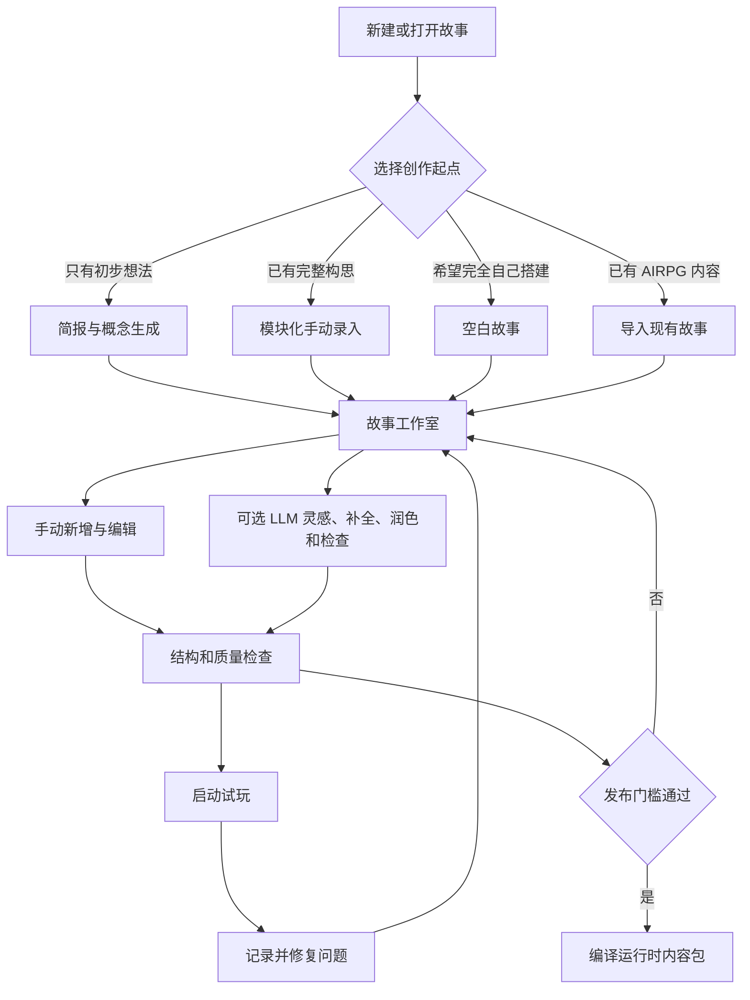
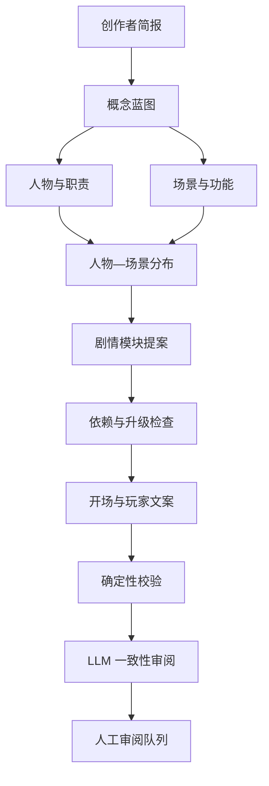
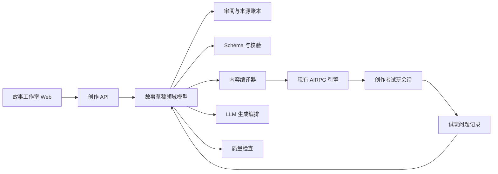

# AIRPG 故事工作室方案设计

状态：方案讨论稿 0.2
日期：2026-08-05

实现进度：阶段 A 的首个纵向版本已经提供模块化手动编辑、自动保存、实时结构校验和内嵌试玩；字段级 LLM 灵感、补全、润色、一致性检查及审阅账本也已接入。基于短简报的概念提案和完整故事分阶段生成仍按后续阶段实现。

## 0. 已确认的产品决定

1. 目标用户不需要知道 YAML 的存在，也不通过 YAML 完成日常创作。
2. LLM 可以生成最终会进入故事运行时的文字，但所有生成文字必须能够被创作者逐项查看、修改和确认。
3. 未经创作者审阅的生成文字可以用于早期试玩，但不能进入可发布版本。
4. 不要求无损保留导入 YAML 的注释、缩进和排版；导入后允许统一格式化。
5. 故事工作室的最终目标是快速生成高质量的新故事，而不只是可视化编辑已有故事。
6. `hogwarts_before_hogwarts` 是第一阶段的导入、编辑、校验与试玩基准，不是产品模板或唯一目标题材。
7. 创作者既可能只有一个初步想法，也可能已经拥有完整的世界观、人物、剧情和开场；两类创作起点都必须得到完整支持。
8. 人物、场景、物品、剧情模块和其他关键内容都可以完全手动新增和编辑。LLM 只提供可选的生成、灵感、润色和检查能力，不是创作的必经步骤。

## 1. 背景与问题

当前 AIRPG 的故事内容使用 `schema_version: 2`、`content_profile: narrative_first` 的 YAML 文件。作者需要提供故事蓝图、玩家身份、人物卡、场景、关键物品、初始位置、叙事规则和可选剧情模块。

现有内容契约已经主动移除了分支脚本、剧情旗标、关系数值、条件结局和任意状态 patch。故事工作室应继承这个方向：帮助作者表达开放叙事所需的素材和边界，而不是重新引入复杂的传统剧情 DSL。

当前霍格沃茨调测故事约 969 行，包括：

- 13 个人物；
- 5 个场景；
- 2 个关键物品；
- 16 个剧情模块；
- 一组较长的故事蓝图、文风规则、开场正文与终局说明。

直接编辑 YAML 的主要成本不是输入标点，而是：

- 作者必须理解技术字段、层级、枚举和机器 ID；
- 人物、场景、物品和模块之间的引用容易漏填或写错；
- 初始位置和物品归属需要重复维护；
- 很难从纯文本看出场景网络与模块依赖关系；
- 玩家可见内容、AI 私有内容和不同模型调用的上下文容易混淆；
- LLM 一次性生成长 YAML 时，局部重试、人工审阅和引用修复都很困难；
- 结构校验通过不代表故事方向清楚、人物有能动性或剧情已经可玩。

## 2. 产品目标

故事工作室应让创作者完成下面的核心任务：

> 无论创作者从一个模糊想法、一份完整大纲还是一组已经写好的人物与剧情设定开始，都能通过模块化界面建立结构完整的可玩故事；LLM 在需要时提供灵感、补全、润色和检查，最终由创作者审阅、试玩并决定正式内容。

### 2.1 成功标准

- 创作者从新建故事到第一次试玩，全程不接触 YAML、机器 ID 或引用语法。
- 输入简短创意后，可以生成覆盖故事蓝图、人物、场景、模块和开场的第一版骨架。
- 已有完整构思的创作者可以跳过概念生成，直接手动添加和编辑蓝图、人物、场景、物品、剧情模块和开场。
- 所有核心创作功能在 LLM 不可用时仍然可以完成。
- 所有进入运行时的文字都能在对应的业务界面中查看和修改。
- 系统能够区分人工文字、LLM 生成文字和系统派生数据。
- 未审阅的 LLM 文字无法被误当成发布完成的内容。
- 场景出口、初始位置、物品归属和模块依赖由系统维护，不产生悬空引用。
- 创作者可以随时从工作室启动现有 AIRPG 引擎试玩当前草稿。
- 当前内容 schema 仍是运行时边界；故事工作室不会扩大引擎的权威状态面。

### 2.2 非目标

第一阶段不包含：

- 多人实时协作、组织权限和审核流；
- 故事市场、付费、公开发布平台；
- 封面、人物立绘和音频等资产生产管线；
- 自动替代创作者完成最终审稿；
- 传统可视化脚本、逐行动分支树、剧情 flag 或效果编辑器；
- 完整模拟成百上千条玩家路径并自动判断文学质量；
- 对手写 YAML 的注释与排版进行无损往返。

## 3. 核心设计原则

### 3.1 业务概念优先

界面使用“故事简介”“隐藏真相”“人物动机”“场景出口”“剧情钩子”等创作语言，不显示 `player_facing_summary`、`initial_state.positions`、`requires.status` 等底层字段名。

YAML 是编译结果和兼容格式，不是用户界面。

### 3.2 手动创作与 LLM 协作同等完整

每一种业务对象都必须有直接的手动创建入口和完整字段编辑器。创作者不需要先让 LLM 生成一个对象，才能开始填写人物、场景或剧情。

LLM 能力作为对象旁边的可选操作出现，例如“给我几个想法”“补全空白字段”“润色这段文字”和“检查与其他设定是否矛盾”。关闭 LLM 后，故事工作室仍然是一套完整的模块化创作工具。

### 3.3 生成模式先形成骨架，再逐层展开

LLM 不直接生成一整份故事 YAML。系统按蓝图、人物、场景、模块和开场分阶段请求结构化结果，由代码分配 ID、建立引用并完成校验。

这样可以在基础方向错误时尽早调整，避免一段错误设定扩散到整份故事。

### 3.4 人工审阅是发布门槛

LLM 生成内容始终是候选稿。创作者可以：

- 确认原文；
- 修改后确认；
- 要求局部重写；
- 清空并自行填写；
- 暂时保留为未审阅状态。

LLM 不得静默覆盖已经审阅的内容。

### 3.5 硬约束由代码维护

机器 ID、引用、枚举、依赖状态、初始位置和物品归属由表单控件与代码维护。LLM 只提出业务实体和文字内容，不负责保证最终引用正确。

### 3.6 质量来自多层闭环

高质量不能由一个 LLM 评分代替。工作室同时依赖：

- 结构与引用校验；
- 创作质量提示；
- LLM 一致性审阅；
- 创作者逐项确认；
- 使用真实运行时进行试玩。

### 3.7 保持叙事优先契约

人物关系、承诺、情绪与剧情意义继续留在散文和记忆中。剧情模块只描述“什么内容适合何时出现”，不获得状态修改权限。

## 4. 目标用户与主要场景

### 4.1 目标用户

主要用户是熟悉故事、人物和情绪设计，但不了解 AIRPG schema 的创作者。他们可能只带着一句话灵感，也可能已经准备好完整大纲、人物小传、剧情阶段和开场正文。他们可能会使用 AI 写作工具，但不应被要求使用 AI，也不应被要求理解 prompt 路由、引用完整性或 YAML 语法。

### 4.2 主要使用场景

1. 从一句话创意生成新故事。
2. 从一个已有梗概扩展出人物、场景和剧情模块。
3. 按照已有完整构思，手动录入故事蓝图、人物、场景、剧情和开场。
4. 在空白故事中手动新增、复制、修改和删除人物、场景、物品与剧情模块。
5. 将已有设定笔记粘贴到工作室，由 LLM 提出结构化整理候选，再由创作者选择是否采用。
6. 导入已有 AIRPG 故事继续编辑。
7. 请求 LLM 为当前字段提供灵感、润色或一致性检查。
8. 查看哪些生成内容尚未审阅。
9. 检查人物、线索、模块依赖和终局铺垫是否一致。
10. 试玩当前草稿，并把试玩问题定位回创作内容。
11. 将审阅完成的故事编译为运行时内容包。

## 5. 端到端创作流程



### 5.1 选择创作起点

新建故事提供四个入口：

1. **从一个想法开始**：填写短简报，由 LLM 提出概念和完整骨架。
2. **我已经有完整构思**：直接进入分区录入向导，按已有设定填写故事、人物、场景、剧情和开场。
3. **创建空白故事**：进入工作室，自由决定先创建哪种内容，不调用 LLM。
4. **导入已有故事**：导入 AIRPG 内容并继续编辑。

四个入口最终进入同一个工作室和同一套内容模型，之后可以随时在手动创作与 LLM 协作之间切换。

### 5.2 完整构思的手动录入

“我已经有完整构思”不是一份要求一次填完的长表单。系统按业务模块提供可跳过、可返回的录入步骤：

1. 故事蓝图与世界设定；
2. 玩家角色；
3. 人物；
4. 场景；
5. 关键物品；
6. 剧情模块与依赖；
7. 开场；
8. 文风和边界。

每一步都允许手动创建任意数量的业务对象。作者可以先只填写关键字段，稍后再补充可选细节。系统在后台生成机器 ID、维护引用和组装初始状态。

“题材与类型”使用开放标签而不是封闭枚举。界面提供常用标签作为快捷建议，创作者也可以输入任意自定义题材；标签用于创作提示、故事库筛选与归类，不代表引擎只支持某些题材。工作室同时维护可读摘要 `genre` 和结构化列表 `genre_tags`，旧内容可以继续读取，创作者不会接触这两个底层字段。

如果创作者已经有大段设定笔记，可以直接保存在“作者素材”区域，随后选择：

- 自己参照素材逐项录入；
- 让 LLM 从素材中提取人物、场景或剧情候选；
- 只让 LLM 检查是否还有遗漏。

提取结果仍然是候选卡片，不会自动覆盖已经手动填写的内容。

### 5.3 从想法生成故事

创作者只需要填写一份短简报：

- 一句话创意；
- 玩家扮演谁；
- 希望玩家持续感受到什么；
- 主要冲突或未知；
- 题材和语气；
- 大致规模：短篇、中篇或长篇；
- 必须出现或必须避免的内容，可选。

第一次生成只产生小型概念提案，包括玩家身份、核心目标、对抗力量、情绪承诺、隐藏真相、可能的终局方向以及建议规模。创作者确认后，系统再按蓝图、人物、场景、物品、模块、开场和玩家文案生成完整骨架。

这个确认步骤只属于“从一个想法开始”的生成入口；手动创作不需要经过概念生成。

### 5.4 混合创作

创作者可以任意混合以下操作：

- 手动创建人物，再让 LLM 提供动机或说话方式的灵感；
- 手动填写人物卡，再让 LLM 只润色公开形象；
- 手动设计主线模块，让 LLM 建议缺少的铺垫模块；
- 接受 LLM 生成的场景骨架，再完全重写场景正文；
- 对已经完成的故事只运行一致性检查，不生成任何内容。

工作室不根据创建入口锁定后续模式。

### 5.5 审阅与完善

凡是 LLM 生成或改写的内容都会进入审阅队列。系统优先引导创作者检查对下游影响最大的蓝图、玩家角色、核心人物、核心场景和主线模块。完全手动填写的内容直接记录为人工来源，不需要额外执行一次形式化确认。

创作者无需按系统建议顺序完成，但界面会显示未审阅数量、建议顺序和受上游修改影响的内容。

### 5.6 试玩与修订

工作室使用当前草稿启动独立试玩会话。试玩中的问题可以记录为：

- 人物失真；
- 秘密泄漏；
- 剧情漂移；
- 模块重复或错序；
- 场景导航问题；
- 开场问题；
- 文风问题；
- 物理事实问题；
- 其他。

问题记录可以关联一个或多个故事字段。返回编辑界面后，系统直接打开相关人物、模块或规则。

## 6. 信息架构与主要页面

### 6.1 故事库

展示：

- 故事标题和一句话简介；
- 草稿、审阅中、可试玩、可发布等状态；
- 未审阅内容数量；
- 阻塞错误和警告数量；
- 最近编辑与最近试玩时间。

支持：

- 从创意新建；
- 从完整构思新建；
- 创建不调用 LLM 的空白故事；
- 导入 AIRPG 内容；
- 复制已有故事；
- 打开、归档和导出。

### 6.2 工作室主界面

建议采用固定结构：

- 顶栏：故事名称、保存状态、审阅进度、质量问题和试玩入口；
- 左侧：故事结构导航；
- 中间：当前业务对象的编辑器；
- 右侧：上下文相关的 LLM 助手和检查建议；
- 可选底部面板：玩家预览、模型上下文预览和运行调试信息。

左侧导航包含：

1. 创作概览；
2. 故事蓝图；
3. 玩家角色；
4. 人物；
5. 场景地图；
6. 关键物品；
7. 剧情模块；
8. 开场；
9. 文风与边界；
10. 审阅队列；
11. 检查结果；
12. 试玩记录。

### 6.3 创作概览

概览页回答四个问题：

- 这个故事讲什么；
- 现在完成到了哪里；
- 下一步最值得处理什么；
- 当前是否可以试玩或发布。

概览不使用虚假的单一“质量分数”，而是展示阻塞项、待审阅项、重要警告和最近试玩问题。

### 6.4 模块化手动填写模式

所有内容编辑器遵循同一套交互模式：

- 列表或卡片区域始终提供明确的“手动新增”按钮；
- 表单按“关键字段”“建议完善”“可选细节”分组，避免一次展示全部复杂度；
- 字段使用创作语言、简短解释和示例，不显示底层字段名；
- 人物、场景、物品和模块的关联使用搜索选择器、卡片或图连线完成；
- 机器 ID、引用数组和初始状态映射完全隐藏并自动维护；
- 手动输入支持自动保存、撤销和版本恢复；
- 每个字段旁边可以有可选的 LLM 操作，但没有任何字段必须先调用 LLM 才能编辑。

推荐的字段级辅助操作为：

| 操作 | 行为 |
|---|---|
| 给我灵感 | 返回若干短候选，不直接写入字段 |
| 帮我补全 | 只为当前空白字段生成候选 |
| 帮我润色 | 保留原文，展示前后差异 |
| 提供其他方向 | 返回不同创作选择及各自影响 |
| 检查一致性 | 读取相关设定并指出具体矛盾，不修改内容 |

手动填写内容保存为人工来源；接受 LLM 候选后才切换为 LLM 来源并进入对应审阅流程。

### 6.5 人物编辑页面示意

人物、场景和剧情模块都可以采用下面这种“列表 + 模块化表单 + 可选助手”的布局：

```text
┌ 人物 ─────────────────────────────────────────────────────────────┐
│ [＋手动新增人物]   [从作者素材提取候选]                            │
├──────────────┬──────────────────────────────────┬─────────────────┤
│ 人物列表      │ 莉迪亚·哈特                      │ 可选 LLM 助手    │
│              │                                  │                 │
│ ● 莉迪亚      │ 关键字段                         │ · 给我几个动机想法│
│ ○ 托比        │ 姓名        [莉迪亚·哈特      ] │ · 补全空白字段    │
│ ○ 麦格        │ 故事职责    [核心同伴/研究者   ] │ · 润色公开形象    │
│              │ 公开形象    [多行文本……        ] │ · 检查人物重复    │
│              │                                  │                 │
│              │ 人物内核                         │ 助手不会自动写入；│
│              │ 动机        [多行文本……        ] │ 选择候选后再预览。│
│              │ 压力        [多行文本……        ] │                 │
│              │ 典型行为    [多行文本……        ] │                 │
│              │                                  │                 │
│              │ 语言与关系                       │                 │
│              │ 说话方式    [多行文本……        ] │                 │
│              │ 初始关系    [多行文本……        ] │                 │
│              │ 示例对白    [＋添加一条         ] │                 │
│              │                                  │                 │
│              │ 故事关联                         │                 │
│              │ 初始场景    [学术侧楼 ▼        ] │                 │
│              │ 参与模块    [符文回应] [信任冲突]│                 │
├──────────────┴──────────────────────────────────┴─────────────────┤
│ 自动保存 · 人工来源 · 结构完整                                   │
└──────────────────────────────────────────────────────────────────┘
```

底层人物 ID、`characters` 层级、初始位置映射和模块引用不会出现在页面中。场景和剧情模块页面复用同样的交互语言，让创作者形成稳定认知。

## 7. 功能模块设计

### 7.1 故事蓝图

创作者可以从空白表单手动填写，也可以让 LLM 根据简报或作者素材提出候选。可编辑内容包括：

- 故事前提；
- 玩家可见的一句话简介；
- 希望玩家持续获得的情绪体验；
- 玩家在故事中的角色；
- 主要目标和核心矛盾；
- 对抗力量；
- 世界规律；
- 隐藏真相；
- 设计目标和作者备注。

界面必须显式标注信息去向：

- 玩家可见；
- 仅旁白模型可见；
- 旁白和行动建议模型可见；
- 仅创作者可见。

`hidden_truth` 使用醒目的私有标识，并提供信息路由预览，防止创作者误以为它会显示给玩家。

### 7.2 玩家角色

玩家角色可以完全手动创建和修改。编辑内容包括：

- 姓名与公开身份；
- 私人目标；
- 玩家表达和能力边界；
- 对应的人物公开卡片；
- 初始场景。

系统自动维护玩家人物记录与玩家角色配置之间的关联，不要求作者重复输入相同信息。

### 7.3 人物工作室

人物列表始终提供“手动新增人物”。点击后创建一张空白人物卡，创作者可以只填写关键字段后保存，也可以继续完善全部设定。每个人物使用卡片编辑：

- 姓名；
- 故事职责；
- 玩家能够知道的公开形象；
- 动机；
- 说话方式；
- 初始关系；
- 秘密；
- 压力；
- 典型行为；
- 习惯动作；
- 旁白表演说明；
- 示例对白；
- 初始位置。

辅助能力包括：

- 手动新增、复制、排序、归档和删除人物；
- 为当前空白字段提供若干灵感候选；
- 对创作者已经填写的某个字段进行局部润色，并展示前后差异；
- 根据故事蓝图生成人物候选；
- 根据“动机—压力—行为”检查人物是否完整；
- 检查多个人物是否功能重复；
- 生成和对比示例对白；
- 在重命名人物时自动维护全部引用；
- 显示该人物参与的场景、物品和剧情模块。

LLM 不直接决定人物 ID。系统根据名称生成稳定 ID，之后修改显示名称不会自动改变 ID。

### 7.4 场景地图

创作者可以点击“手动新增场景”建立空白场景卡，也可以在地图空白处直接创建节点。场景以节点展示，出口以连线展示。

每个场景包含：

- 名称；
- 在故事中的作用；
- 当前叙事方向；
- 首次进入时的环境文字；
- 静态环境对象；
- 出口；
- 初始位于此处的人物和物品。

编辑出口时，创作者选择目标场景并填写玩家可理解的导航标签。系统可以建议创建反向出口，但不自动假设所有道路都双向。

检查项包括：

- 没有入口的孤立场景；
- 只有进入没有离开的场景；
- 重复出口；
- 开场不可达；
- 场景功能高度重复；
- 大量人物集中在同一初始场景。

### 7.5 关键物品与初始状态

工作室首先提示作者：只有连续归属对后续故事重要的物品才需要进入关键物品列表。

创作者通过“手动新增关键物品”创建物品卡。每件物品包含：

- 名称；
- 描述；
- 是否可携带；
- 是否消耗；
- 被携带时是否对同场景玩家可见；
- 初始位置或持有人。

人物初始位置和物品初始归属由场景界面、人物界面和物品界面共享同一份数据。作者在任何一个入口修改，其他页面立即同步，不需要填写底层 `initial_state`。

### 7.6 剧情模块板

剧情模块提供卡片视图、列表视图和依赖图，并始终提供“手动新增剧情模块”。作者可以完全按照自己的剧情设计填写，也可以只针对当前模块请求钩子、升级方向或铺垫灵感。

每个模块包含：

- 标题；
- 功能分类；
- 叙事目的；
- 抛给玩家的钩子；
- 适合出现的自然语言条件；
- 涉及的人物、场景和物品；
- 玩家接住钩子后的升级方向；
- 怎样算自然收尾；
- 玩家忽略时怎样消退；
- 是否可重复；
- 最早回合；
- 优先级；
- 标签；
- 对其他模块进度的硬依赖。

依赖图只表达 `requires` 这种结构性硬门槛。自然语言触发语义不转换成复杂条件编辑器。

系统检查：

- 循环依赖；
- 引用不存在的实体；
- 依赖永远无法满足；
- 终局缺少必要铺垫；
- 多个模块功能和钩子高度重复；
- 核心人物没有专属模块；
- 模块只描述结局，没有提供玩家介入空间；
- 模块试图携带状态效果或替玩家作决定。

### 7.7 开场编辑器

提供两个同时可见的视图：

- 创作者正文编辑器；
- 玩家启动故事时看到的实际渲染预览。

创作者可以直接粘贴或手写完整开场。LLM 可以根据已审阅的蓝图、人物和起始场景生成开场，也可以只润色选中段落；任何润色都保留原文并展示差异。开场检查包括：

- 是否尽早建立玩家身份和当前处境；
- 是否给出可行动的钩子；
- 是否泄露隐藏真相；
- 是否替玩家决定感情、意图或行动；
- 是否与初始人物位置和场景环境冲突；
- 是否能作为后续旁白的文风样本。

多开场作为后续增强功能；第一版需要正确导入和编辑已有多开场，但可以不提供复杂的多开场生成向导。

### 7.8 文风、边界与关键提醒

创作者可以手动逐项添加、排序和删除规则。编辑内容包括：

- 语气；
- 叙事视角和镜头；
- 对话风格；
- 应避免的写法；
- 世界和内容边界；
- 叙事指南；
- 最多 4 条最高优先级提醒。

LLM 可以将散乱要求归类为上述区域，并提示重复或互相冲突的规则。系统必须解释不同区域会进入哪些模型调用，不能把所有规则混成一个提示词大文本框。

### 7.9 审阅中心

审阅中心是故事工作室的核心模块，而不是附加页面。

每个会进入运行时的文本单元保存：

- 当前内容；
- 来源：人工、LLM 生成、LLM 改写或导入；
- 审阅状态；
- 最后修改者；
- 最后修改时间；
- 生成时所依据的上下文版本；
- 可选的生成前后差异。

审阅状态定义：

| 状态 | 含义 |
|---|---|
| `unreviewed` | LLM 已生成，但创作者尚未确认 |
| `reviewed` | 创作者已经查看并确认当前版本 |
| `needs_review` | 已审阅内容依赖的重要上游信息发生变化，建议重新确认 |
| `manual` | 完全由创作者填写，视为已审阅 |

导入的已有故事默认标记为 `reviewed_import` 或等价的已审阅状态，不强迫作者重新确认每个字段。

审阅动作包括：

- 确认当前字段；
- 编辑并确认；
- 重新生成；
- 查看生成依据；
- 将整张人物卡或整个小节标记为已审阅。

为了减少机械点击，允许对一个完整业务对象进行整体审阅，例如一次确认一张人物卡，但界面必须先完整展示其中所有运行时文字。

### 7.10 上游变更与重新审阅

系统不应在故事前提发生一个字的变化后把所有内容全部打回未审阅。重新审阅采用分级策略：

- 名称、ID 和引用的确定性同步不改变文字审阅状态；
- 对文字含义影响较小的修改只产生提示；
- 故事蓝图、隐藏真相、玩家身份或终局方向发生实质变化时，将直接依赖的 LLM 内容标记为 `needs_review`；
- 人工撰写内容不自动失去确认状态，但会出现在一致性检查建议中；
- LLM 只能针对受影响字段提出修改候选，不能自动覆盖。

第一版可以使用显式依赖关系和生成上下文版本判断，后续再增加语义差异分析。

### 7.11 校验与质量中心

质量中心分四层展示问题，不使用单一总分。

#### A. 结构错误

会阻止试玩或编译：

- 必填内容缺失；
- 数据类型错误；
- 非法枚举；
- 重复机器 ID；
- 内容无法解析。

#### B. 引用错误

会阻止试玩或编译：

- 出口目标不存在；
- 人物没有初始场景；
- 关键物品没有初始归属；
- 模块引用不存在的实体；
- 模块依赖不存在或形成循环。

#### C. 创作质量提示

通常不阻止试玩：

- 人物缺少清楚的动机—压力—行为链；
- 多个人物承担相同叙事功能；
- 场景不能为行动、线索或关系提供价值；
- 主线模块没有逐步升级；
- 终局代价没有得到铺垫；
- 隐藏路线在前期模块中被直接泄露；
- 关键人物长期没有参与任何模块；
- 开场没有给玩家明确行动空间；
- 关键提醒过长、重复或互相冲突；
- 作者上下文预计过长。

这些判断必须展示依据，不能只给出“质量较低”一类不可操作结论。

#### D. 运行检查

- 使用当前草稿创建会话；
- 渲染开场；
- 生成行动建议；
- 使用 mock provider 完成一次基本回合；
- 检查作者私有信息的 prompt 路由；
- 检查人物位置与关键物品初值。

### 7.12 试玩工作台

试玩工作台复用现有 AIRPG 引擎，不建立另一套故事解释逻辑。

创作者侧附加信息可以包括：

- 当前场景和在场人物；
- 当前候选剧情模块；
- 模块软状态；
- 当前滚动小结；
- 行动建议获得的故事方向；
- 旁白使用的作者私有上下文；
- 本回合 trace；
- 试玩问题标注。

这些调试信息只在创作者模式显示，不进入玩家产品界面。

草稿包含未审阅文字时允许试玩，但顶部持续显示“包含未审阅生成内容”，并提供返回审阅队列的入口。

### 7.13 编译与发布门槛

故事可以有三个不同状态：

| 状态 | 条件 | 能力 |
|---|---|---|
| 可编辑草稿 | 内容可以不完整 | 编辑和局部生成 |
| 可试玩草稿 | 结构、引用和运行初始化通过 | 启动创作者试玩 |
| 可发布版本 | 所有阻塞错误已解决，所有运行时生成文字已审阅 | 编译正式内容包 |

发布门槛至少要求：

- 必填业务内容完整；
- 所有结构和引用校验通过；
- 所有 LLM 生成的运行时文字为已审阅状态；
- 当前审阅版本与待编译内容一致；
- 至少成功完成一次运行初始化检查。

质量警告默认不阻止发布，但必须在发布确认页集中展示。

## 8. LLM 辅助系统设计

### 8.1 能力层级

LLM 是可选能力层，不是故事工作室的数据入口或必需依赖。功能分为五类：

1. 概念生成：从短简报形成可讨论的故事方向。
2. 灵感建议：为人物动机、场景功能、剧情钩子等返回多个可选方向。
3. 结构扩展：只生成创作者指定的人物、场景、模块或开场候选。
4. 局部润色：在保留原文的前提下扩写、压缩或改写当前字段。
5. 全局审阅：查找矛盾、重复、缺失铺垫和潜在信息泄漏。

主要交互应是当前页面中的上下文操作，而不是要求创作者通过一个通用聊天框完成全部工作。每次调用都由创作者明确发起；系统不在后台自动续写或改写手动内容。

### 8.2 生成模式的结构化管线

下面的管线仅适用于“从一个想法开始”或创作者主动选择“生成缺失部分”的场景。手动录入不会被强制经过此管线。



每个阶段：

- 使用明确的结构化输出 schema；
- 只读取当前阶段所需的最小上下文；
- 由代码生成稳定 ID 并解析引用；
- 在进入草稿前执行字段级校验；
- 支持单独重试，不重新生成已确认的其他阶段；
- 保存生成请求对应的草稿 revision，防止旧结果覆盖新编辑。

### 8.3 修改候选

对于已有内容，LLM 返回字段级 patch 候选，而不是完整故事替换。候选应包含：

- 修改目标；
- 修改后的文字；
- 修改理由；
- 依赖了哪些已审阅内容；
- 是否建议连带检查其他字段。

创作者可以逐字段接受或拒绝。接受后状态变为 `unreviewed`，直到创作者确认最终文字；如果接受动作本身已经展示了完整文字，也可以将“接受并确认”作为一次明确操作。

“给我灵感”默认只生成独立候选列表；在创作者选择“采用”前，它不写入故事草稿。“帮我润色”必须同时显示创作者原文和建议稿，并支持只采用建议中的部分句子。

### 8.4 生成质量控制

- 系统 prompt 固定当前 AIRPG 作者契约，拒绝生成退休 DSL。
- 生成模块时不允许出现 `effects`、`state_patch`、条件结局或替玩家作决定的指令。
- 生成隐藏真相时检查是否泄漏到玩家简介和开场。
- 生成人物时优先建立动机、压力、行为和独立价值，不只生成性格标签。
- 生成场景时要求每个场景具有叙事功能和可行动内容。
- 生成终局时要求代价提前铺垫并保留玩家明确选择。
- 长故事分段生成，避免上下文过长导致前后漂移。

### 8.5 成本、失败与恢复

- 每次生成显示预计范围，而不是要求创作者理解 token。
- 失败只影响当前候选，不破坏已保存草稿。
- 支持取消、重试和切换 provider。
- API key 只保存在服务端配置中。
- 生成记录保存 provider、模型、时间和草稿 revision，便于复现问题。
- LLM 不可用时，所有人工编辑、校验、导入和试玩功能仍可使用。

## 9. 业务模型与运行时映射

创作者界面使用业务名称，编译器负责映射到当前内容契约。

| 工作室区域 | 运行时内容 |
|---|---|
| 故事身份 | `id`、`title`、`version`、`language`、`genre`、`genre_tags` |
| 玩家展示 | `player_facing_summary`、`opening_narration` |
| 故事蓝图 | `premise`、`emotional_contract`、`ai_plot` |
| 叙事控制 | `narrative_guidelines`、`critical_reminders`、`style_bible`、`global_rules` |
| 玩家角色 | `player_role` 与对应的玩家人物卡 |
| 人物工作室 | `characters` |
| 场景地图 | `scenes` 及其 `exits`、`available_objects` |
| 关键物品 | `items` |
| 初始分布 | `initial_state.positions`、`initial_state.item_locations` |
| 剧情模块 | `modules` |
| 多开场 | `openings` |

工作室还需要不进入运行时内容的创作元数据：

- 字段来源和审阅状态；
- 生成记录与上下文 revision；
- 质量问题及处理状态；
- 试玩问题；
- 页面展示偏好；
- 草稿和发布版本信息。

这些信息不能混入旁白 prompt，也不能被内容编译器导出到正式故事字段。

## 10. 系统模块边界



### 10.1 Web 客户端

负责：

- 表单、卡片、富文本与图编辑；
- 审阅队列和差异展示；
- 校验问题定位；
- 生成任务状态；
- 试玩和调试面板。

客户端不独立实现 schema 规则，只消费服务端提供的字段定义、枚举和校验结果。

### 10.2 故事草稿领域模型

负责：

- 以业务对象表示故事、人物、场景、物品和模块；
- 稳定 ID 与引用重构；
- 草稿 revision 和并发冲突保护；
- 统一编辑命令；
- 为编译、LLM 和试玩提供一致快照。

### 10.3 Schema 与校验服务

当前 `validate_content.py` 的规则应逐步抽取成唯一的可复用定义，供：

- 创作 API；
- 工作室实时校验；
- 内容编译器；
- 命令行校验器；
- 测试。

避免工作室和现有校验脚本分别维护两套规则。

### 10.4 内容编译器

负责：

- 将草稿快照转换成 `schema_version: 2` 内容；
- 补充系统派生字段；
- 统一排序和格式化；
- 在编译前执行阻塞校验；
- 生成试玩包或正式发布包。

第一阶段不修改现有运行时的内容读取接口。

### 10.5 LLM 生成编排

负责：

- 分阶段 prompt 和结构化输出；
- 最小上下文选择；
- provider 与模型适配；
- revision 检查；
- 候选 patch；
- 重试、取消、记录和错误恢复。

### 10.6 审阅与来源账本

负责记录字段级或业务对象级的来源、审阅状态和上下文版本。它是发布门槛的一部分，但不进入故事运行时状态。

### 10.7 试玩适配层

负责把草稿编译为临时内容快照，并交给现有 `GameSession`、旁白、模块编排器、记忆和事实管线运行。试玩会话与故事编辑 revision 绑定，草稿变化后提示创建新会话，避免把旧会话误认为当前内容的验证结果。

## 11. 存储与版本策略

逻辑上的权威来源是“故事草稿 + 创作元数据”，不是用户手写 YAML。

第一阶段可以采用：

- 规范化的故事内容文件保存运行时字段；
- 独立 sidecar 保存审阅、生成和试玩元数据；
- 编译时生成与现有引擎兼容的 YAML；
- 导入已有 YAML 时转换为故事草稿，保存后允许统一格式化。

具体采用文件还是数据库持久化可以在实现设计阶段决定，但必须满足：

- 内容与审阅元数据具有同一个 draft revision；
- 自动保存是原子的；
- 可以恢复最近版本；
- LLM 旧响应不能覆盖新版本；
- 能够生成清楚的版本差异；
- 正式发布版本不可被后续草稿编辑静默改变。

## 12. 霍格沃茨调测方案

霍格沃茨故事用于验证工作室对复杂现有内容的承载能力。

### 12.1 导入与语义往返

- 导入当前故事不丢失运行时字段；
- 13 个人物、5 个场景、2 个关键物品和 16 个模块完整出现；
- 人物位置、物品归属、场景出口和模块依赖正确；
- 编译后的内容通过现有校验器；
- 不要求注释、空行和键顺序与原文件完全一致。

### 12.2 编辑能力

- 修改人物姓名时引用保持有效；
- 移动人物初始位置时场景和人物页面同步；
- 新增场景并连接出口无需填写 ID；
- 修改模块依赖时依赖图即时更新；
- 隐藏真相、玩家简介和开场具有不同的信息可见标识；
- 任意长文本都可编辑并进入审阅记录。

### 12.3 审阅能力

- 导入内容默认视为已审阅；
- 对单个模块使用 LLM 改写后，只有受影响内容进入待审阅状态；
- 未审阅修改允许试玩但阻止发布；
- 接受并编辑候选后可以明确完成确认。

### 12.4 试玩能力

- 从工作室一键启动开场；
- 旁白使用当前草稿而非磁盘旧版本；
- 能查看候选模块和作者上下文路由；
- 试玩问题可以关联回具体人物、场景、模块或规则。

### 12.5 新故事生成对照

除导入霍格沃茨外，还应准备一个只包含短简报的同题材或非同题材测试，验证系统确实能够从零生成结构完整的新故事，而不是只擅长编辑已有内容。

## 13. 分阶段实施建议

### 阶段 A：工作室骨架与单一内容模型

- 抽取可复用的内容 schema 和校验服务；
- 建立故事草稿领域模型；
- 实现故事库、导入和自动保存；
- 实现故事蓝图、人物、场景、物品和模块的基础编辑；
- 确保所有业务对象可以在不调用 LLM 的情况下手动新增和完整编辑；
- 实现模块化表单、关键/建议/可选字段分组和自动引用维护；
- 实现编译和现有校验器兼容；
- 使用霍格沃茨完成语义往返测试。

### 阶段 B：新故事生成与审阅闭环

- 实现短简报和概念提案；
- 实现分阶段结构化生成；
- 实现字段来源、审阅状态和发布门槛；
- 实现局部重写和字段级候选 patch；
- 实现字段级灵感、补全和保留原文的润色操作；
- 实现审阅队列与上下文变更提示。

完成此阶段后，产品才真正具备“快速生成新故事”的核心价值。

### 阶段 C：可视化结构与质量检查

- 场景图；
- 模块依赖图；
- 创作质量提示；
- 信息路由预览；
- 全局一致性审阅；
- 生成和上下文成本可视化。

### 阶段 D：试玩反馈闭环

- 工作室内试玩；
- 创作者调试信息；
- 试玩问题标注和内容关联；
- 草稿 revision 与试玩会话绑定；
- 发布前运行检查。

阶段 A 和阶段 B 应优先形成一条完整纵向路径，不宜先把所有编辑页面做完，再补生成与审阅。

## 14. MVP 验收条件

第一版可以在满足以下条件时视为 MVP 完成：

1. 非技术创作者可以从短简报创建故事，不接触 YAML。
2. 已经拥有完整构思的创作者可以跳过生成，通过模块化 UI 手动建立蓝图、玩家、NPC、场景、关键物品、模块和开场。
3. 人物、场景、关键物品和剧情模块均可独立手动新增、复制、修改和删除，不需要先由 LLM 生成。
4. 系统可以分阶段生成一份包含蓝图、玩家、NPC、场景、关键物品、模块和开场的可玩草稿。
5. 创作者可以对任意关键文本字段请求灵感、补全或保留原文的润色，也可以完全不使用这些能力。
6. 所有生成文字都有明确来源、审阅状态和可编辑入口。
7. 未审阅生成文字不会进入可发布版本。
8. 场景、人物、物品和模块引用由系统自动维护。
9. 当前霍格沃茨故事能够完整导入、编辑、编译并通过现有校验。
10. 创作者可以一键试玩当前草稿。
11. 可以从试玩问题返回并定位到相关创作内容。
12. 故事工作室生成的正式内容可以由现有 AIRPG 运行时直接读取。

## 15. 后续需要讨论的设计问题

以下问题不阻塞方案成立，但会影响实现顺序：

1. 第一版是仅本地单用户使用，还是从一开始就需要远程账户和云端保存？
2. “发布”在第一阶段是生成仓库内正式内容文件，还是还需要独立的内容包和版本清单？
3. LLM provider 是否沿用当前 DeepSeek/Kimi 配置，还是工作室需要独立的生成模型选择？
4. 第一版是否只支持纯文本字段，还是开场和简介需要基础富文本？
5. 新故事的默认规模模板如何定义，例如短篇、中篇、长篇分别建议多少人物、场景和模块？
6. 质量提示中哪些规则可以直接从霍格沃茨测试归纳，哪些必须通过更多真实新故事后再加入？

这些问题应在实现计划中逐项确认，但不改变本方案的核心边界：模块化手动创作、可选 LLM 协作、分阶段生成、人工审阅、确定性校验和真实试玩闭环。
